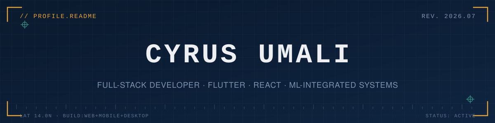
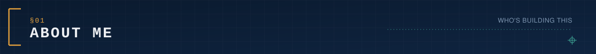
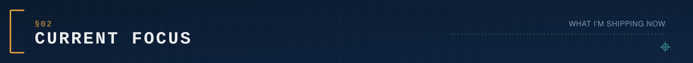
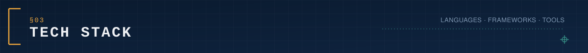
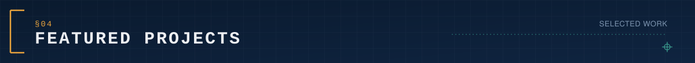
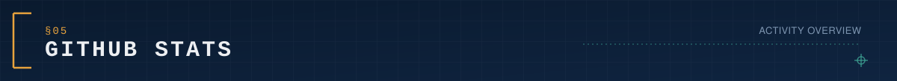
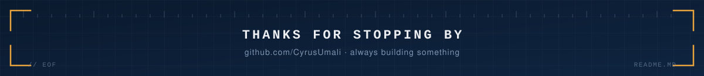

  

  
  

  

  

  

I'm a full-stack developer who builds across web, mobile, and desktop — from government-facing farm management systems to ML-powered crop recommenders and retro-style games. I like taking projects from a rough idea to a working, shippable product, usually solo or with a small randomly-assigned team during internships and coursework.

  

  

- 🌾 Building **AgriTrack**, a Flutter-based farm management platform for municipal agriculture offices
- 🧠 Applying **Random Forest / ML models** to real soil data for crop recommendation (Agritrack AI)
- 📚 Shipping utility tools like **BulkQuil** (EPUB cleaner) and **Cytdlp** (media downloader)
- 🎮 Occasionally making small games (Spring Boot, Windows Forms, RPG Maker)

  

<h2 align="center">Table of Contents</h2>

  <a href="#tech-stack">Tech Stack</a> ·
  <a href="#featured-projects">Featured Projects</a> ·
  <a href="#github-stats">GitHub Stats</a>

  

  

<h3 align="center">Languages</h3>

<table>
<tr>
<td></td>
<td></td>
<td></td>
<td></td>
<td></td>
<td></td>
<td></td>
</tr>
</table>

<h3 align="center">Frameworks & Libraries</h3>

<table>
<tr>
<td></td>
<td></td>
<td></td>
<td></td>
<td></td>
<td></td>
<td></td>
</tr>
</table>

<h3 align="center">Databases & Cloud</h3>

<table>
<tr>
<td></td>
<td></td>
<td></td>
<td></td>
<td></td>
<td></td>
</tr>
</table>

<h3 align="center">Tools</h3>

<table>
<tr>
<td></td>
<td></td>
<td></td>
<td></td>
<td></td>
</tr>
</table>

  

  

<table>
<tr>
<td width="50%" valign="top">

### 🌾 [AgriTrack](https://github.com/CyrusUmali/Agritrack_)
Farm management platform for municipal agriculture offices — crop tracking, barangay mapping, DA-compliant reporting.
`Flutter` `Cross-platform` `Municipal-level`
[Live Demo](https://agritracklp.vercel.app/)

</td>
<td width="50%" valign="top">

### 🧠 [Agritrack AI](https://github.com/CyrusUmali/AiCROP)
ML crop recommender trained on real San Pablo City soil data, 85%+ accuracy via Random Forest.
`Random Forest` `Python ML` `Gemini API`

</td>
</tr>
<tr>
<td width="50%" valign="top">

### 📖 [NovelNexus](https://github.com/CyrusUmali/NovelNexus)
Subscription-based library management system with digital lending and automated billing.
`PHP` `Stripe` `Member Portal`

</td>
<td width="50%" valign="top">

### 🧹 [BulkQuil](https://github.com/CyrusUmali/BulkQuil)
Interactive EPUB cleaner that removes residual TTS-breaking HTML via rule-based selection.
`React` `EPUB Editor`
[Live Demo](https://bulk-quil.vercel.app/)

</td>
</tr>
<tr>
<td width="50%" valign="top">

### 🚗 Prime Road Motors
Car e-commerce & test drive scheduling platform, built during OJT with a randomly assigned team.
`React` `Node.js` `Team Project`
[Live Demo](https://prime-road-motors-g3.vercel.app/)

</td>
<td width="50%" valign="top">

### 👗 [Alpshop](https://github.com/CyrusUmali/ALPSHOP)
First full-stack e-commerce build — catalog, cart, checkout, and payment gateway for a fashion seller.
`E-commerce` `Payment Gateway`

</td>
</tr>
<tr>
<td width="50%" valign="top">

### 🎬 [Cytdlp](https://github.com/CyrusUmali/cytdlp)
Mobile app for pulling video/audio from any URL up to 4K, powered by a bundled Flask + yt-dlp backend.
`Flask` `Capacitor` `Android`

</td>
<td width="50%" valign="top">

### ⚔️ [CodeBorn](https://github.com/CyrusUmali/Codeborn-Web-D)
2D RPG where players solve coding problems to win turn-based battles — a school project.
`RPG Game Maker` `Educational`

</td>
</tr>
</table>

<i>See more on <a href="https://github.com/CyrusUmali?tab=repositories">github.com/CyrusUmali</a></i>

  

  

  
  

 

  

 

  

  

  

